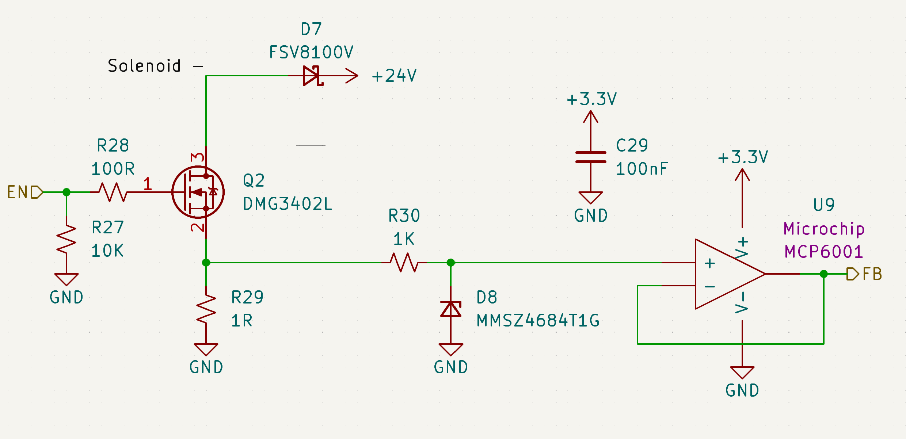
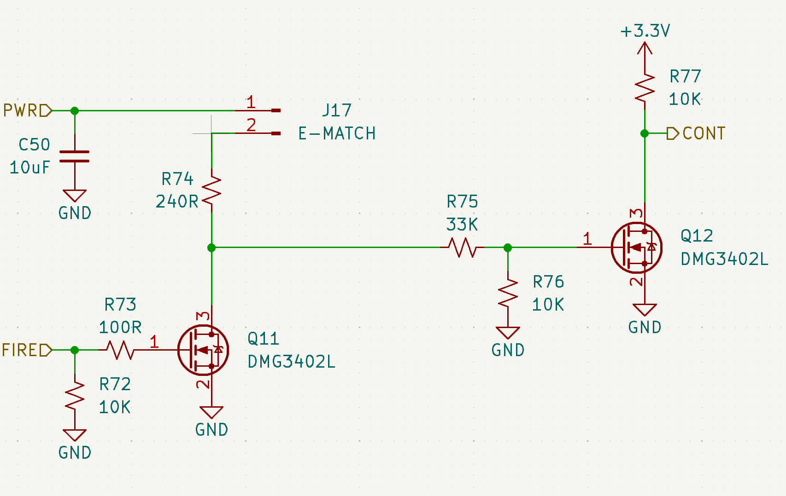
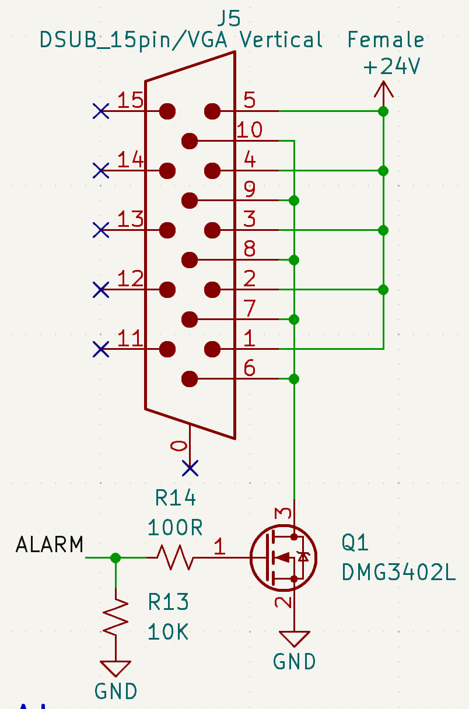

# Overview
The GSE supports 3 actuator types: Solenoid Valves, E-matches, and the Alarm.

The GSE includes:
- 12 Solenoid Valve output channel
- 2 E-match output channels
- 1 Alarm output channels

# Hardware Specifications

placeholder

# Solenoid Valves

The GSE includes 12 solenoid valve out channels.

W.I.P.

# E-matches

The GSE includes 2 e-match output channels.

The e-match driver circuit uses a two-stage MOSFET switching configuration to safely control current delivery to the e-match load.

In the 1st stage, a logic-level MOSFET acts as a pre-driver, translating the MCU GPIO signal into a gate drive signal for the main switching MOSFET. This provides signal buffering and ensures reliable gate charging under varying MCU drive conditions.

The 2nd stage MOSFET functions as the primary power switch for the ignition path. When its gate voltage is driven above the threshold, it conducts between drain and source, completing the current path through the e-match to ground and initiating ignition.

Gate resistors are used to limit transient currents and control switching speed, while pull-down resistors ensure both MOSFETs remain in a defined OFF state during MCU reset, startup, or high-impedance conditions.

This architecture isolates the MCU from high-current switching events and improves robustness against noise, inadvertent triggering, and gate charge retention.

# Alarm

The GSE includes only 1 alarm output channel.

In the alarm driver circuit, a MCU GPIO control signal (ALARM) drives the gate of an N-channel MOSFET through a series resistor (R14). In parallel, a pull-down resistor (R13) tied to GND ensures a defined OFF state and prevents the build-up of residual charge.

The MOSFET source is connected to ground, and the drain is connected to the alarm load supply path.

When the ALARM signal is asserted, the gate voltage exceeds the MOSFET’s threshold voltage, enabling conduction between drain and source. This completes the low-side switching path and energizes the alarm circuit.
