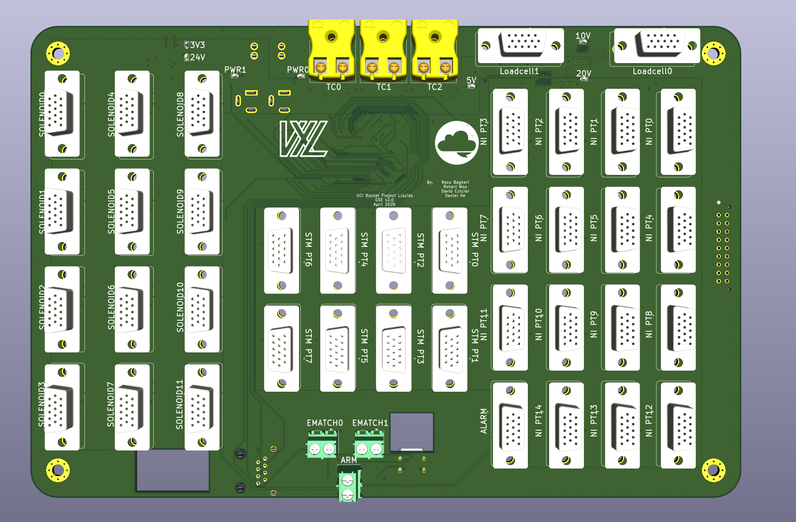

# GSE Docs

## System Overview

For MOCH4, the GSE (Ground Support Equipment) PCB is the heart of ground testing. Responsible for comprehensive sensor data acquisition, ignition, and valve actuation. It consists of 5 high-level functional subsystems: *power*, *sensing*, *compute*, *actuation*, and *communications*.

##Stakeholders: 
- AV - Hardware: Responsible for layout of the 4-layer stackup. Refer to for GSE PCB design justifications. 
- AV - Software: Responsible for firmware, including sensing, control, and failsafe behavior. Refer to GSE behavior justifications.
- Propulsion: Valve actuation (GN2 Fill, Vent, and MVAS), Sensor calibration
- Launch Vehicle: Mounting specifications, Fitment constraints, Connector access, and Harnessing.

## Quick Specifications
| Parameter        | Value                           | Requirement Reference |
|------------------|----------------------------------|------------------------|
| Input Voltage    | 24V DC                          | ECU requirement       |
| Logic Level      | 3.3V                            | STM32 Standard        |
| Mounting Pattern | 4x M4 holes with 4.3mm clearance| Avionics              |
| Dimensions       | 257mm x 171mm                   | AV Bay Requirement    |

## Architecture at a glance
- [Power](power.md)
- [Sensing](sensing.md) 
- [Compute](compute.md) 
- [Communications](communications.md)
- [Actuation](actuation.md) 

## Layout at a glance
- 4 Layer Stackup: (placeholder for chart)
- Integrated Connectors: AM-K-PCB, Barrel Jack, DSUB, RJ45, USB-C, Barrel Jack
- Component Partitions: Power, Signal, and GND
- Debugger Accessibility: ARM SWD (Serial Wire Debug)
