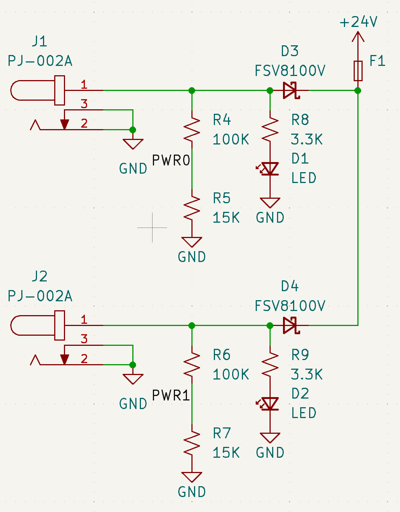
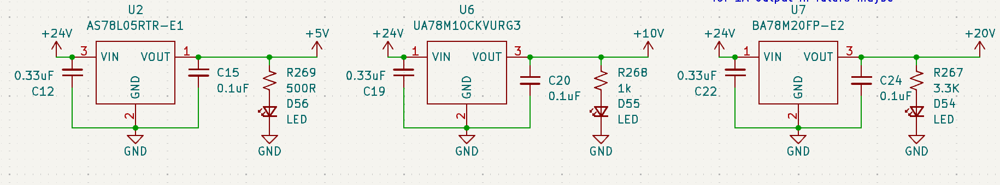
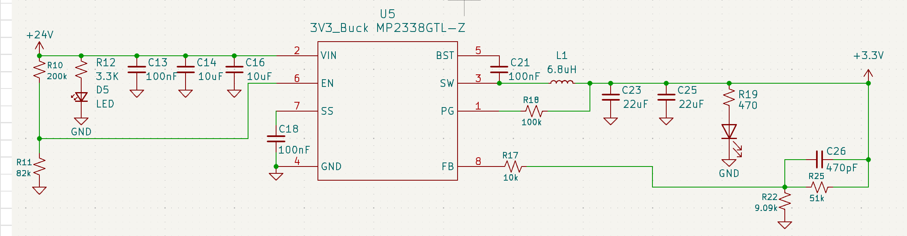

# Voltage Regulation

# Overview
The GSE takes in a 24V supply via barrel jack, which is stepped down via a buck regulator or one of multiple LDOs.

# Hardware Specifications

| Component              | Input Voltage | Output Voltage | Output Current |
|------------------------|--------------|----------------|----------------|
| [Buck regulator (U5)](https://jlcpcb.com/partdetail/Monolithic_PowerSystems-MP2338GTLZ/C7210174)    | 24V nominal   | 3.3V           | 3A             |
| [LDO regulator (U2)](https://jlcpcb.com/partdetail/DiodesIncorporated-AS78L05RTRE1/C90471)    | 24V nominal   | 5V             | 100 mA         |
| [LDO regulator (U6)](https://jlcpcb.com/partdetail/TexasInstruments-UA78M10CKVURG3/C2868719)    | 24V nominal   | 10V            | 500 mA         |
| [LDO regulator (U7)](https://jlcpcb.com/partdetail/ROHMSemicon-BA78M20FPE2/C5336616s)    | 24V nominal   | 20V            | 500 mA         |

## Power Input

24V DC Power is accepted via two barrel jacks intended for redundant use, with only one input used at a time. Supplies the 24V power rail.

Each input is monitored by a voltage divider (R4 & R5, and R6 & R7), which feeds into the PWR0 and PWR1 GPIO pins for power detection.

Schottsky diodes (100V, 8A) are used to prevent current backflow between supplies. 

LED indicators (D1 & D2) provide visual confirmation when input voltage is present at each jack.

## Synchronous Buck Regulator: Logic Level

A synchronous buck regulator converts the 24V power rail into the 3.3V logic level supply rail.

The below table details inputs and outputs

| Pin | Name | Type | Function |
|-----|------|------|----------|
| 1 | PG (Power Good) | Digital Output | Indicates when output regulation is in range |
| 2 | VIN | Power Input | Input supply voltage for the regulator |
| 3 | SW | Power Node | Switching node connected to inductor |
| 4 | GND | Ground | System reference ground |
| 5 | BST (Bootstrap) | Power/Control | Supplies gate drive voltage for high-side MOSFET |
| 6 | EN (Enable) | Digital Input | Enables or disables regulator operation |
| 7 | SS (Soft-Start) | Analog | Controls output voltage ramp-up timing |
| 8 | FB (Feedback) | Analog Input | Senses output voltage for regulation loop |

## Low Dropout (LDO) Regulators: 20V, 10V, 5V

Three independent LDO regulators convert the 24V power rail into 5V, 10V, and 20V supply rails, providing isolated power domains for downstream subsystems. 

Input decoupling capacitors (C12, C19, C22) stabilize each LDO supply rail and minimize input ripple. Output capacitors (C15, C20, C24) are required to ensure stable operation of the regulators' internal control loops.

LED indicators (D56, D55, D54) provide visual confirmation when input voltage is present at each jack.

