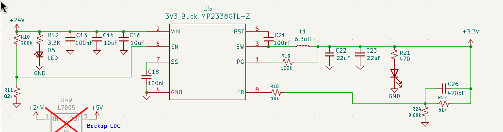
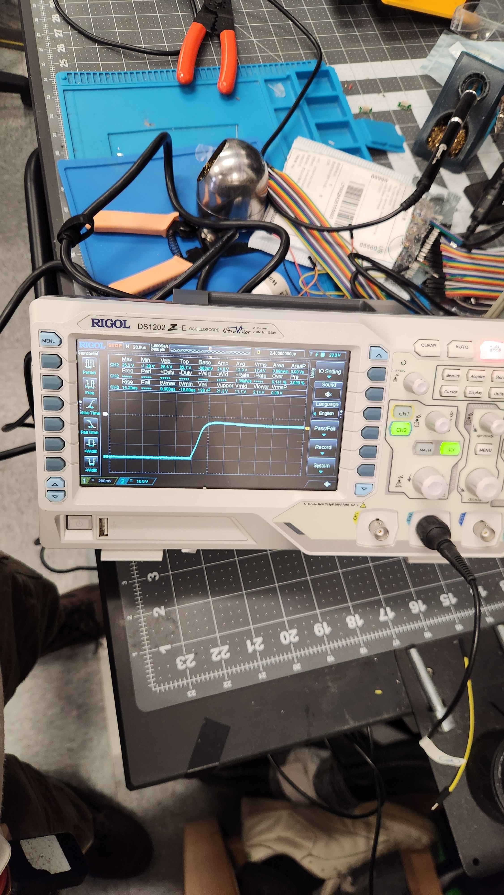

# Power
Last updated: 7/12/26

By: Robert Woo

The GSE takes in a 24V supply via 2 redundant, 5.5mm barrel jack connectors. Only 1 ports is needed to turn power the board. 1 buck regulator and 3 Linear Drop-outs 
(LDOs) are used to step down this input voltage to various voltages for sub-circuits on GSE v2.1

---

## Power Input

24V DC Power is accepted via two barrel jacks intended for redundant use, with only one input used at a time. Supplies the 24V power rail.

Each input is monitored by a voltage divider (R4 & R5, and R6 & R7), which feeds into the PWR0 and PWR1 GPIO pins for power detection and input voltage readings.

Schottky diodes (100V, 8A) are used to prevent current backflow between the 2, redundant, power supply inputs. 

LED indicators (D1 & D2) provide visual confirmation when input voltage is present at each jack.

Here's an example of what kind of power brick is used to power the board : 
[Power brick](https://www.amazon.com/dp/B0D5B33JCH?ref=nb_sb_ss_w_as-reorder_k3_1_4&amp=&crid=30QKH8CISRCDL&amp=&sprefix=24v+)

---

## Power regulators

GSE v2.1 currently has 3 LDOs and 1 buck regulator to power the following voltage rails:

| Component              | Input Voltage | Output Voltage | Output Current |
|------------------------|--------------|----------------|----------------|
| [Buck regulator (U5)](https://jlcpcb.com/partdetail/Monolithic_PowerSystems-MP2338GTLZ/C7210174)      | 24V nominal   | 3.3V           | 3A             |
| [LDO regulator (U2)](https://jlcpcb.com/partdetail/DiodesIncorporated-AS78L05RTRE1/C90471)            | 24V nominal   | 5V             | 100 mA         |
| [LDO regulator (U6)](https://jlcpcb.com/partdetail/TexasInstruments-UA78M10CKVURG3/C2868719)          | 24V nominal   | 10V            | 500 mA         |
| [LDO regulator (U7)](https://jlcpcb.com/partdetail/ROHMSemicon-BA78M20FPE2/C5336616s)                 | 24V nominal   | 20V            | 500 mA         |

## Synchronous Buck Regulator: 3.3V Logic Level

A synchronous buck regulator converts the 24V power rail into the 3.3V logic level supply rail. This circuit basically follows the datasheet exactly for a 3.3V 
output, and this buck converter was chosen mainly because it internally compensates the feedback loop. Aka, buck converters are hard and this synchronous buck 
converter, the higher efficency version, was easy AF in drop in.

---

### TROUBLESHOOTING / BUCK FAILURE

During usage of GSE v2.1 in Spring 2026, this buck converter failed/exploded after plugging in a 24V power supply into the barrel jacks of the board. This caused
everything on 3.3V bus to fry. DEAD AF BOARD

This was caused by inductive kick. Basically, wires has parasitive inductance in them. Inductors resists a change in current, and when you say, plug in a power
supply into a PCB, the inductance of the wires will causing an overshoot in voltage because current is basically infinite the moment charges start moving.

This was troubleshooted and found out mainly because GSE v2.1 was tested previously wiwth a DC power supply and shorter cables comparative to the 24 power brick
later used.

The picture above is just unplugging and replugging in the 24V power brick and reading the voltage that the buck converter would see with an oscilloscope with a single
shot trigger setting. As you can see, the buck converter sometime can see a max of 68V whenever you plug power in :0000000.

---

The solution: Put an electrolytic capacitor in parallel with Vin of the buck converter. Electrolytic capacitors generally have a high Equivalent Series Resistance (ESR)
can and was used on GSE v2.1 to slow down the infinite current that this buck converter would see.

This was result with the oscilloscope probing the same point as before, but with an electrolytic capacitor in parallel with the other ceramic capacitors for the MP2338GTL-Z
Much better at dampening out the overshoot

---
#### Recommendation in the future:
&nbsp;

1. CHANGE THE BUCK CONVERTER IC

The MP2338GTL-Z has a highest input voltage rating 30V, which is low and why buck converter failed and killed everything from it downstream. NASA's derating guidelines say
to use components that can tolerate about 1.6 times the expected voltage range in normal operation. So get a buck converter that can take 38.4V or higher.

2. Still add the electrolytic capacitor in parallel with the next buck converter, just in case.

## Low Dropout (LDO) Regulators: 20V, 10V, 5V

Three independent LDO regulators convert the 24V power rail into 5V, 10V, and 20V supply rails, providing isolated power domains for downstream subsystems. 

The 20V and 10V LDOs are used to power PTs/Potentiometers and Loadcells respectively. This was done because LDOs, while less efficient, have Power Supply Rejection Ratio 
(PSRR). This ratio is a curve that represents how well the IC can filter out noise at the input of the regulator, which allows for the output voltage powering the sensors
to be clean. It is not uncommon to see 60Hz oscillations in sensor readings because that is the frequency that the wall power is oscillating at.

Input decoupling capacitors (C12, C19, C22) stabilize each LDO supply rail and minimize input ripple. Output capacitors (C15, C20, C24) are required to ensure stable operation of
the regulators' internal control loops.

LED indicators (D56, D55, D54) provide visual confirmation of the LDOs functionality.

