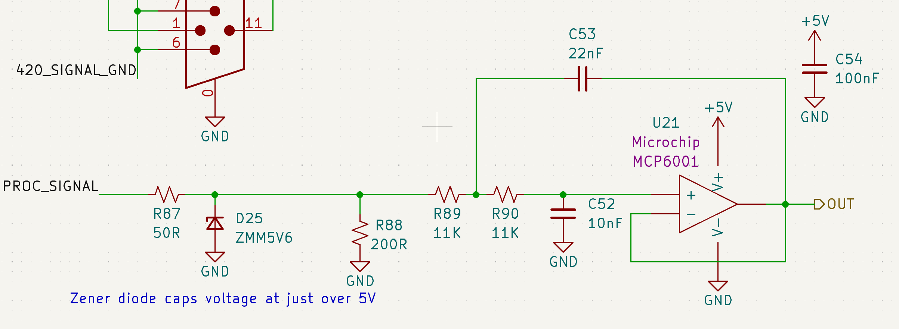
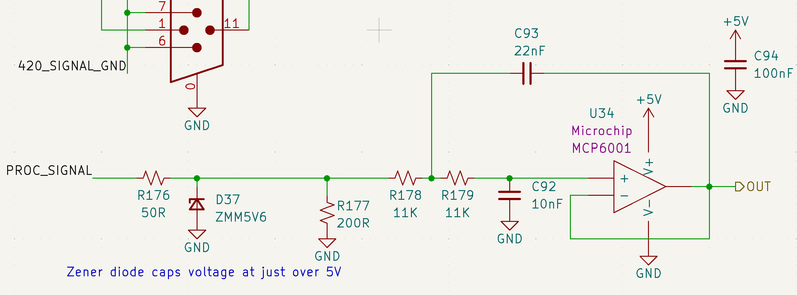
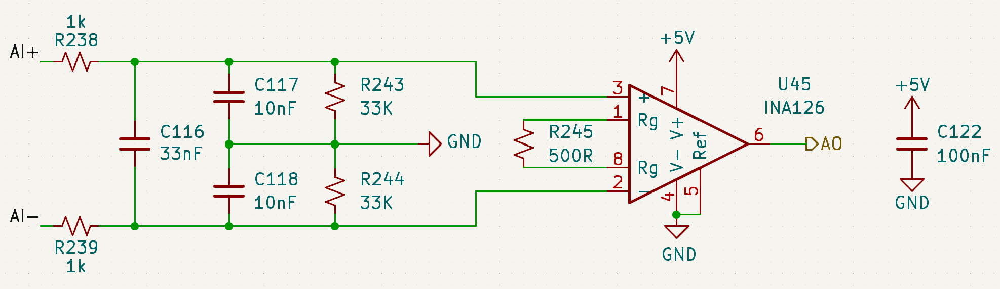
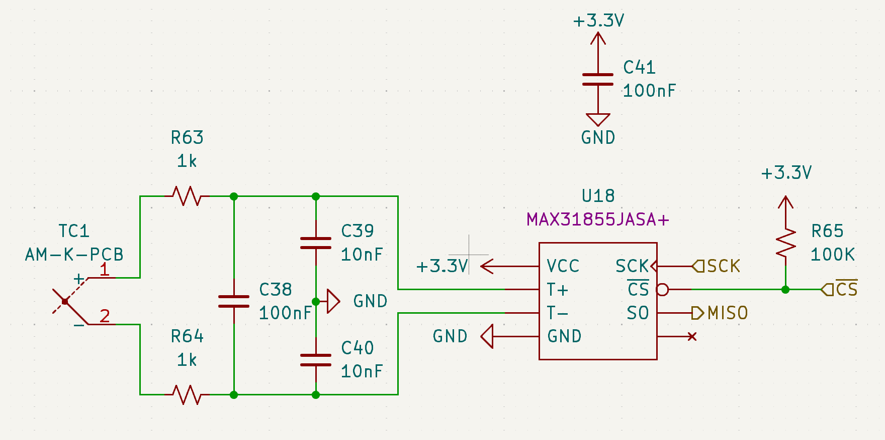

# Overview
The GSE supports 4 sensor types: Pressure Transducers (PTs), Voltage Sensors (Potentiometers), Load Cells, and Thermocouples (TCs).

The GSE includes:
- 14 PT input channels
- 8 potentiometer input channels
- 2 load cell input channels
- 3 TC input channels

# Hardware Specifications

| Sensor Type                                             | Input Voltage | Signal Conditioning                                                     |
|---------------------------------------------------------|--------------|-------------------------------------------------------------------------|
| [Pressure Transducers](https://transducersdirect.com/wp-content/uploads/2018/07/TDH40-8.19.pdf)                             | 20V          | [Op-amp](https://jlcpcb.com/partdetail/MicrochipTech-MCP6001T_EOT/C29429)                                                          |
| [Voltage Sensors](link)                                  | 20V          | [Op-amp](https://jlcpcb.com/partdetail/MicrochipTech-MCP6001T_EOT/C29429)                                                          |
| [Load Cells](link)                                      | 10V          |  [Op-amp](https://jlcpcb.com/partdetail/TexasInstruments-INA126U2K5/C181300) + RC Filter                 |
| [Thermocouples](link)                                   | 3.3V         | [Dedicated ADC (U18)](https://www.analog.com/media/en/technical-documentation/data-sheets/MAX31855.pdf)                                            |

# Pressure Transducers (PTs) 

The GSE includes 14 pressure transducer (PT) input channels.

Each PT 0-5V signal is received through a DSUB connector and routed through a low-pass filter that removes high-frequency noise before digitization.

This filter is implemented as a 2nd-order active Sallen-Key topology with a Butterworth response (flat passband) and a cutoff frequency of 1kHz (fastest possible PT response to pressure change).

A Zener diode at the input provides overvoltage protection, with breakdown at ~5.5V to protect downstream circuitry. 

The conditioned signals are then fed to the NI DAQ for analog-to-digital conversion.

# Voltage Sensors (Potentiometers)

The GSE includes 8 multipurpose voltage sensor (potentiometer) input channels.

These channels are used to measure the actuator position of the Main Valve Actuation System (MVAS) via mounted potentiometers.

(figure of pot mounted on MVAS)

Each potentiometer signal is received through a DSUB connector and routed through a low-pass filter that removes high-frequency noise before digitization. 

The circuit is identical to that used for the PTs. Refer to the PT section for filter implementation details.

A Zener diode at the input provides overvoltage protection, with breakdown at ~5.5V to protect downstream circuitry. 

The conditioned signals are then fed to a dedicated ADC (U8), from which they are read by the STM32 microcontroller.

# Load Cells 

The GSE includes 2 load cell (LC) input channels.

Each differential load cell signal is received through a DSUB connector and routed through a low-pass filter followed by an op-amp differential-to-single-ended converter.

This filter is implemented as a passive RC network with both differential and common-mode low-pass filtering. The cutoff frequency is ~2.1kHz, selected to reduce high-frequency noise prior to amplification.

Then the differential amplifier converts the filtered load cell differential signal to a single-ended voltage suitable for digitization.

The conditioned signals are then fed to the NI DAQ for analog-to-digital conversion.

# Thermocouples (TCs)

The GSE includes 3 thermocouple (TC) input channels.

Each TC signal is received through a AM-K-PCB connector (specialized connector for K-type thermocouples) and routed through a low-pass filter that removes high frequency noise before digitization.

This filter is implemented as a passive RC network with both differential and common-mode low-pass filtering. 

The conditioned signals are then fed to dedicated ADCs (U18, U19, U20 respectively for each channel), from which they are read by the STM32 microcontroller.

(image of TC circuit)
