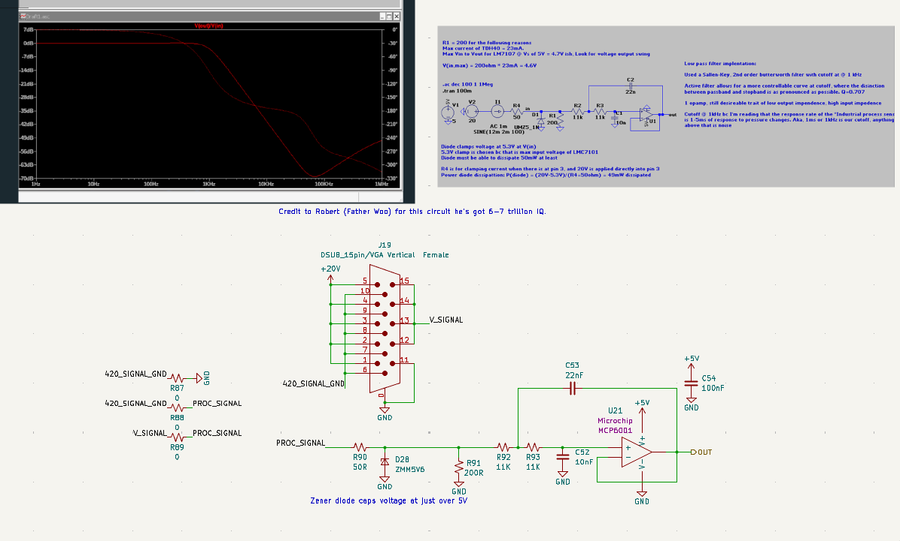

# Overview
Last updated: 7/12/26

By: Robert Woo
The GSE supports 4 sensor types: Pressure Transducers (PTs), Potentiometers (POTs), Load Cells, and Thermocouples (TCs).

The GSE includes:

* 18-19 PT/POTS input channels
    * 14-15 high speed NiDAQ channels
    * 4 External I2C ADC channels
* 5-6 load cell input channels
    * 1-2 high speed NiDAQ channels
    * 4 External I2C ADC channels 
* 3 TC input channels

The reason for the 14 - 15 Ni PT channels an 1-2 Ni Load cell channels is because the board can toggle the connection between the ports:

* Loadcell1
* NI PT14

being connected to pin 16 on the molex connector that connects to the NiDAQ

---

## Hardware Specifications

| Sensor Type                                             | Input Voltage |
|---------------------------------------------------------|---------------------------------------------------------------------------------------|
| [Pressure Transducers](https://transducersdirect.com/wp-content/uploads/2018/07/TDH40-8.19.pdf) | 20V          
| [Voltage Sensors](https://www.digikey.com/en/products/detail/tt-electronics-bi/P160KNPD-4FC20B10K/2408891)                                 | 20V         |
| [Load Cells](https://www.interfaceforce.com/wp-content/uploads/SSM_SSM2-1.pdf)                                      | 10V          |
| [Thermocouples](link)                                   | 3.3V         |

---

## Pressure Transducers (PTs) & Potentiometers (POTs)

The GSE includes 18-19 pressure transducer (PT/POTs) input channels.

PTs and POTs share the same circuit since the signal conditioning is the same. The unviersal adapter board steps down the voltage that
the POT would see in order have the POT output a range of 0-5V.

On GSE v2.1, this circuit can be configured for either 3 wire, voltage-sensing pressure transducers or 2 wire, 4-20mA pressure transducers

* For voltage-sensing PTs, populate R87 and R88 and depopulate R89
* For 4-20mA PTs, do the opposite of the voltage-sensing PTs

Each PT/POT 0-5V signal is received through a DSUB connector and routed through a low-pass filter that removes high-frequency noise 
before digitization.

This filter is implemented as a 2nd-order active Sallen-Key topology with a Butterworth response (flat passband and slow roll-off) and a 
cutoff frequency of 1kHz (fastest possible a PT can response to pressure change).

A Zener diode (D25) at the input provides overvoltage protection, with breakdown at ~5.5V to protect downstream circuitry. 

The conditioned signals are then fed either to the:

* The Molex port, which connects to the NI DAQ for high speed PT/POTS readings.
* An external I2C ADC, for slower PT/POTS

[Reference](https://www.ti.com/lit/an/sboa226/sboa226.pdf?ts=1783865113347)

### Future changes
The circuit is fine, but GSE v2.1 done goofed and forget the pullups for I2C. Dumbass robert

--- 

## Load Cells 

The GSE includes 5-6 load cell input channels.

Each differential load cell signal is received through a DSUB connector and routed through a low-pass filter followed by an op-amp differential-to-single-ended converter.

This filter is implemented as a passive RC network with both differential and common-mode low-pass filtering. The cutoff frequency is ~2.
1kHz, selected to reduce high-frequency noise prior to amplification.

Then the differential amplifier converts the filtered load cell differential signal to a single-ended voltage suitable for digitization.

Loadcells output a mV voltage difference between the AI+ and AI- pins. The differential amplifier takes in, say for example, a voltage 
difference between AI+ and AI- of 10mV, and amplifies that signal into a present voltage range, depending on gain, which is chosen by the
value of resistor between the RG pins. Read the datasheet for the formulas

The conditioned signals are then fed to the NI DAQ or the I2C ADC for analog-to-digital conversion.

--- 

### Future changes
Robert done goofed on this circuit as well. 2 problems with the differential amplifier:

1. The REF pin is tied to ground and the IC isn't rail-to-rail
    * From the datasheet, the INA126U2K5 being not rail-to-rail means that positive and negative "output voltage swing" is -0.75V the
    positive rail, and + 0.8V the negative rail. This is a problem when reading mV readings. From the formulas in the datasheet, if your 
    expected output range is between the negative rail and +0.8V of the negative rail, the ouput will now change
    * Fix: add a voltage rail with a voltage somewhere above 0.8V and keep the negative rail of the differential amplifier at 0V
        * This will allow for the diff amplifier to have the output voltage stay in its operating range so its output voltage will change to the loadcells mV differenital changes

2. The positive rail is powered by 5V
    * This was dumb by robert. The loadcell in the loadcell circuit is powered by 10V. Loadcells use a wheatstone bridge circuit to 
    output mV differences in its differential signal to represent force. Wheastone bridges are basically voltage dividers, the V+ and V- 
    signals, aka **the common-mode voltage of AI+ and AI- of the loadcell is 5V**. The differential amplifier can't operate if the 
    voltages at its IN+ and IN- pins are higher than the voltage on the V+ rail.    
    * Fix: Power V+ with 10V as well in the next iteration, change the gain value with (Rg) to stay within a 0-5V range and add some
    voltage clamping circuit so that you don't blow up the external i2c adc.
        * You should keep the 10V on the loadcell power to move as far away from the noise floor as possible
        * Add something like a voltage follower on the output of the diff amplifier if for whatever reason (AI+ - Ai-) is extremely high 
        and you don't want to send 10V to the external i2c adc. That ADC can handle a max of 5.0V + 0.3V

# Thermocouples (TCs)

The GSE includes 3 thermocouple (TC) input channels.

Each TC signal is received through a AM-K-PCB connector (specialized connector for K-type thermocouples) and routed through a low-pass filter that removes high frequency noise before digitization.

This filter is implemented as a passive RC network with both differential and common-mode low-pass filtering. 

The conditioned signals are then fed to dedicated ADCs (U18, U19, U20 respectively for each channel), from which they are read by the STM32 microcontroller.